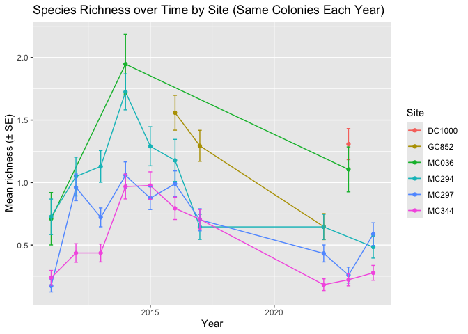
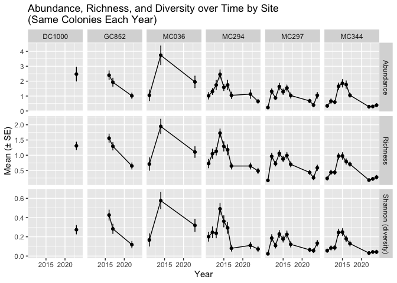

Epifaunal Associate Stats
================
Jack Howell

## Load Libraries

``` r
library(tidyverse)
library(here)
library(vegan)
library(seacarb)
library(lubridate)
library(car)
library(lme4)
library(scales)
library(ggeffects)
library(sjPlot)
library(patchwork)
library(forcats)
library(tidytext)
library(dplyr)
library(tidyr)
library(stringr)
library(ggplot2)
library(ggimage)
library(forcats)
```

## Load in Data

``` r
df <- readr::read_csv("master.csv")
if ("???" %in% names(df)) df <- df %>% select(-`???`)
meta_cols <- c("Site", "Year", "Coral Colony", "Size_m")
species_cols <- setdiff(names(df), meta_cols)
df <- df %>%
  mutate(across(all_of(species_cols), ~ suppressWarnings(as.numeric(.x)))) %>%
  mutate(across(all_of(species_cols), ~ replace_na(.x, 0)))
```

\##Calculate Richness, Abundance, and Diversty metrics per row (colony
level)

``` r
df_stats <- df %>%
  rowwise() %>%
  mutate(
    Richness = sum(c_across(all_of(species_cols)) > 0, na.rm = TRUE),   # richness still counts how many species present
    Abundance = sum(c_across(all_of(species_cols)), na.rm = TRUE),     # total counts (no > 0 here)
    Shannon   = vegan::diversity(c_across(all_of(species_cols)), index = "shannon")  # uses relative abundances
  ) %>%
  ungroup()
```

## Standard Error and Site × Year summary (mean ± SE, n)

``` r
#Calculates the standard Error with a Standard error functoin that can be called later
se <- function(x) if (length(x) > 1) sd(x, na.rm = TRUE)/sqrt(sum(!is.na(x))) else 0


sum_sy <- df_stats %>%
  group_by(Site, Year) %>%
  summarise(
    n = n(),
    Richness_mean = mean(Richness, na.rm = TRUE),
    Richness_se   = se(Richness),
    Abundance_mean = mean(Abundance, na.rm = TRUE),
    Abundance_se   = se(Abundance),
    Shannon_mean   = mean(Shannon, na.rm = TRUE),
    Shannon_se     = se(Shannon),
    .groups = "drop"
  ) %>%
  arrange(Site, Year)

sum_sy
```

    ## # A tibble: 36 × 9
    ##    Site    Year     n Richness_mean Richness_se Abundance_mean Abundance_se
    ##    <chr>  <dbl> <int>         <dbl>       <dbl>          <dbl>        <dbl>
    ##  1 DC1000  2023   104         1.31        0.125           2.47        0.465
    ##  2 GC852   2016    68         1.56        0.140           2.40        0.305
    ##  3 GC852   2017    68         1.29        0.124           1.93        0.277
    ##  4 GC852   2022    68         0.647       0.104           1.01        0.195
    ##  5 MC036   2011    38         0.711       0.210           1.05        0.366
    ##  6 MC036   2014    38         1.95        0.238           3.74        0.630
    ##  7 MC036   2023    38         1.11        0.180           1.95        0.397
    ##  8 MC294   2011    62         0.726       0.142           1.02        0.225
    ##  9 MC294   2012    62         1.05        0.155           1.31        0.205
    ## 10 MC294   2013    62         1.13        0.127           1.74        0.309
    ## # ℹ 26 more rows
    ## # ℹ 2 more variables: Shannon_mean <dbl>, Shannon_se <dbl>

## Richeness over time

``` r
years_per_site_same <- df_stats %>%
  dplyr::group_by(Site) %>%
  dplyr::summarise(n_years_site = dplyr::n_distinct(Year), .groups = "drop")

colonies_in_all_years_same <- df_stats %>%
  dplyr::group_by(Site, `Coral Colony`) %>%
  dplyr::summarise(n_years = dplyr::n_distinct(Year), .groups = "drop") %>%
  dplyr::inner_join(years_per_site_same, by = "Site") %>%
  dplyr::filter(n_years == n_years_site) %>%
  dplyr::select(Site, `Coral Colony`)

## New Site × Year summary (only persistent colonies)
sum_sy_samecolonies <- df_stats %>%
  dplyr::semi_join(colonies_in_all_years_same, by = c("Site", "Coral Colony")) %>%
  dplyr::group_by(Site, Year) %>%
  dplyr::summarise(
    n = dplyr::n(),
    Richness_mean  = mean(Richness, na.rm = TRUE),
    Richness_se    = se(Richness),
    Abundance_mean = mean(Abundance, na.rm = TRUE),
    Abundance_se   = se(Abundance),
    Shannon_mean   = mean(Shannon, na.rm = TRUE),
    Shannon_se     = se(Shannon),
    .groups = "drop"
  ) %>%
  dplyr::arrange(Site, Year)

## Plot using the same-colony summary
p_rich_samecolonies <- ggplot(sum_sy_samecolonies,
                              aes(x = as.integer(Year),
                                  y = Richness_mean,
                                  color = Site,
                                  group = Site)) +
  geom_line() +
  geom_point() +
  geom_errorbar(aes(ymin = Richness_mean - Richness_se,
                    ymax = Richness_mean + Richness_se),
                width = 0.15) +
  labs(title = "Species Richness over Time by Site (Same Colonies Each Year)",
       x = "Year", y = "Mean richness (± SE)") +
  theme(legend.position = "right")

p_rich_samecolonies
```

<!-- -->

## Diversity over time

``` r
## Plot Shannon diversity using same-colony summary
p_shan_samecolonies <- ggplot(sum_sy_samecolonies,
                              aes(x = as.integer(Year),
                                  y = Shannon_mean,
                                  color = Site,
                                  group = Site)) +
  geom_line() +
  geom_point() +
  geom_errorbar(aes(ymin = Shannon_mean - Shannon_se,
                    ymax = Shannon_mean + Shannon_se),
                width = 0.15) +
  labs(title = "Diversity over Time by Site (Same Colonies Each Year)",
       x = "Year", y = "Mean Shannon (± SE)") +
  theme(legend.position = "right")

p_shan_samecolonies
```

<!-- -->
\## Abundanceover Time

``` r
p_abun_samecolonies <- ggplot(sum_sy_samecolonies,
                              aes(x = as.integer(Year),
                                  y = Abundance_mean,
                                  color = Site,
                                  group = Site)) +
  geom_line() +
  geom_point() +
  geom_errorbar(aes(ymin = Abundance_mean - Abundance_se,
                    ymax = Abundance_mean + Abundance_se),
                width = 0.15) +
  labs(title = "Abundance over Time by Site (Same Colonies Each Year)",
       x = "Year", y = "Mean abundance (± SE)") +
  theme(legend.position = "right")

p_abun_samecolonies
```

<!-- -->
\## Yearly

``` r
# Reshape to long format: one row per Site-Year-Metric (with mean & SE)
metrics_long_same <- sum_sy_samecolonies %>%
  mutate(Year = as.integer(Year)) %>%
  select(
    Site, Year,
    Abundance_mean, Abundance_se,
    Richness_mean,  Richness_se,
    Shannon_mean,   Shannon_se
  ) %>%
  pivot_longer(
    cols = -c(Site, Year),
    names_to = c("metric", "stat"),
    names_pattern = "(Abundance|Richness|Shannon)_(mean|se)",
    values_to = "value"
  ) %>%
  pivot_wider(names_from = stat, values_from = value) %>%
  # nice metric labels
  mutate(metric = factor(metric, levels = c("Abundance", "Richness", "Shannon"),
                         labels = c("Abundance", "Richness", "Shannon (diversity)")))

# Plot: rows = metric, columns = site; free y so each metric reads clearly
p_site_metrics_same <- ggplot(metrics_long_same, aes(x = Year, y = mean, group = 1)) +
  geom_line() +
  geom_point() +
  geom_errorbar(aes(ymin = mean - se, ymax = mean + se), width = 0.15) +
  facet_grid(metric ~ Site, scales = "free_y") +
  labs(
    title = "Abundance, Richness, and Diversity over Time by Site\n(Same Colonies Each Year)",
    x = "Year",
    y = "Mean (± SE)"
  ) +
  theme(legend.position = "none")

p_site_metrics_same
```

    ## `geom_line()`: Each group consists of only one observation.
    ## ℹ Do you need to adjust the group aesthetic?
    ## `geom_line()`: Each group consists of only one observation.
    ## ℹ Do you need to adjust the group aesthetic?
    ## `geom_line()`: Each group consists of only one observation.
    ## ℹ Do you need to adjust the group aesthetic?

<!-- -->

## Mean Richness, Abunadance and Diversity by Site

``` r
# helper function for SE
se <- function(x) sd(x, na.rm = TRUE) / sqrt(sum(!is.na(x)))

# summarise all three metrics at site level
site_summary <- df_stats %>%
  group_by(Site) %>%
  summarise(
    mean_abun = mean(Abundance, na.rm = TRUE),
    se_abun   = se(Abundance),
    mean_rich = mean(Richness, na.rm = TRUE),
    se_rich   = se(Richness),
    mean_shan = mean(Shannon, na.rm = TRUE),
    se_shan   = se(Shannon),
    .groups = "drop"
  )

# base theme
base_theme <- theme_minimal(base_size = 14) +
  theme(
    legend.position = "none",
    axis.text.x = element_text(angle = 45, hjust = 1),
    plot.title = element_text(size = 14, face = "bold")
  )

# Abundance
p_abun <- ggplot(site_summary, aes(x = Site, y = mean_abun, fill = Site)) +
  geom_col(width = 0.7) +
  geom_errorbar(aes(ymin = mean_abun - se_abun, ymax = mean_abun + se_abun),
                width = 0.2) +
  labs(title = "Abundance", x = "Site", y = "Mean abundance") +
  base_theme

# Richness
p_rich <- ggplot(site_summary, aes(x = Site, y = mean_rich, fill = Site)) +
  geom_col(width = 0.7) +
  geom_errorbar(aes(ymin = mean_rich - se_rich, ymax = mean_rich + se_rich),
                width = 0.2) +
  labs(title = "Richness", x = "Site", y = "Mean richness") +
  base_theme

# Shannon diversity
p_shan <- ggplot(site_summary, aes(x = Site, y = mean_shan, fill = Site)) +
  geom_col(width = 0.7) +
  geom_errorbar(aes(ymin = mean_shan - se_shan, ymax = mean_shan + se_shan),
                width = 0.2) +
  labs(title = "Diversity", x = "Site", y = "Mean Diversity") +
  base_theme

# Combine with patchwork
(p_abun | p_rich | p_shan) +
  plot_layout(ncol = 3)
```

<!-- -->

``` r
# Path to the folder with images
img_dir <- "/Users/flagship/Documents/uh_masters/Associate\ Research\ Master\'s\ Thesis/Hypothesis\ Testing/basic_ea_stats/Speceis"
```

``` r
# Get all .png and .jpg files (adjust as needed)
img_files <- list.files(img_dir, pattern = "\\.(png|jpg|jpeg)$", full.names = TRUE)

# Quick check
head(img_files)
```

    ## [1] "/Users/flagship/Documents/uh_masters/Associate Research Master's Thesis/Hypothesis Testing/basic_ea_stats/Speceis/Actiniaria sp. 1.png"   
    ## [2] "/Users/flagship/Documents/uh_masters/Associate Research Master's Thesis/Hypothesis Testing/basic_ea_stats/Speceis/Actiniaria sp. 3.png"   
    ## [3] "/Users/flagship/Documents/uh_masters/Associate Research Master's Thesis/Hypothesis Testing/basic_ea_stats/Speceis/Amathillopsis sp. ?.png"
    ## [4] "/Users/flagship/Documents/uh_masters/Associate Research Master's Thesis/Hypothesis Testing/basic_ea_stats/Speceis/Amphipoda sp. 2.png"    
    ## [5] "/Users/flagship/Documents/uh_masters/Associate Research Master's Thesis/Hypothesis Testing/basic_ea_stats/Speceis/Amphipoda sp. hy.png"   
    ## [6] "/Users/flagship/Documents/uh_masters/Associate Research Master's Thesis/Hypothesis Testing/basic_ea_stats/Speceis/Anamenia sp. 1.png"

``` r
length(img_files)
```

    ## [1] 15

``` r
library(magick)
```

    ## Linking to ImageMagick 6.9.13.29
    ## Enabled features: cairo, fontconfig, freetype, heic, lcms, pango, raw, rsvg, webp
    ## Disabled features: fftw, ghostscript, x11

``` r
# Read all images as a list of magick-image objects
imgs <- lapply(img_files, image_read)
```

``` r
species_totals <- df_stats %>%
  select(all_of(species_cols)) %>%
  summarise(across(everything(), \(x) sum(x, na.rm = TRUE))) %>%
  pivot_longer(cols = everything(),
               names_to = "Species", values_to = "Total") %>%
  filter(Total > 0) %>%                                    # drop zero-abundance
  filter(!str_detect(Species, "Asteroschema"),
         !str_detect(Species, "Hydrozoa")) %>%              # remove these groups
  arrange(desc(Total)) %>%
  mutate(Species = fct_reorder(Species, Total))

# Select top 15 species after filtering
top15 <- species_totals %>% slice_max(Total, n = 15)

# Plot
ggplot(top15, aes(x = Species, y = Total, fill = Species)) +
  geom_col() +
  coord_flip() +
  labs(title = "Top 15 Most Abundant Species",
       x = "Species", y = "Total Abundance") +
  theme_minimal(base_size = 14) +
  theme(
    legend.position = "none",
    axis.text.y = element_text(size = 10)
  )
```

<!-- -->

``` r
library(dplyr)
library(stringr)
library(ggimage)   # for image plotting inside ggplot

# Example: make a tibble of species + image path
img_tbl <- tibble(
  Species = basename(img_files) |> str_remove("\\.png$"), # adjust extension
  img = img_files
)

# Join with your top15
top15 <- top15 %>%
  left_join(img_tbl, by = "Species")
```

``` r
library(ggplot2)
library(ggimage)

ggplot(top15, aes(x = Species, y = Total, fill = Species)) +
  geom_col() +
  # add images to the right of each bar
  geom_image(aes(image = img), 
             size = 0.07,     # adjust size
             by = "width",    # scale relative to axis
             nudge_y = 50) +  # move them a little to the right of the bar
  coord_flip() +
  labs(title = "Top 15 Most Abundant Species",
       x = "Species", y = "Total Abundance") +
  theme_minimal(base_size = 14) +
  theme(
    legend.position = "none",
    axis.text.y = element_text(size = 10)
  )
```

<!-- -->

## Top 15 Most Rich Species

``` r
# Species "richness" here = how many colonies each species appears in (incidence)
species_incidence <- df_stats %>%
  select(all_of(species_cols)) %>%
  summarise(across(everything(), \(x) sum(x > 0, na.rm = TRUE))) %>%  # <-- presence counts
  pivot_longer(everything(), names_to = "Species", values_to = "Incidence") %>%
  filter(Incidence > 0) %>%
  filter(!str_detect(Species, "Asteroschema"),
         !str_detect(Species, "Hydrozoa")) %>%
  arrange(desc(Incidence)) %>%
  mutate(Species = fct_reorder(Species, Incidence))

# Top 15 by incidence (across all sites/years/colonies)
top15_inc <- species_incidence %>% slice_max(Incidence, n = 15)

ggplot(top15_inc, aes(x = Species, y = Incidence, fill = Species)) +
  geom_col() +
  coord_flip() +
  labs(title = "Top 15 Species by Richness (excluding Asteroschema & Hydrozoa)",
       x = "Species", y = "Number of colonies present") +
  theme_minimal(base_size = 14) +
  theme(legend.position = "none",
        axis.text.y = element_text(size = 10))
```

<!-- -->

## Broken up by Site Most Abundant Species

``` r
# 0) Load or construct df_stats *earlier* in the Rmd.
stopifnot(exists("df_stats"))

# 1) Identify species columns robustly (numeric, non-meta, has any nonzero)
known_meta <- c(
  "Site","Year","Richness","Abundance","Shannon",
  "Size_m","Size (m)","Notes","Observer","Transect","PhotoID","ID","Index"
)

species_cols <- df_stats %>%
  select(-any_of(known_meta)) %>%
  select(where(is.numeric)) %>%
  select(where(~ suppressWarnings(max(., na.rm = TRUE)) > 0)) %>%
  names()

stopifnot(length(species_cols) > 0)

# 2) Build species_by_site (excludes Asteroschema & Hydrozoa)
species_by_site <- df_stats %>%
  select(Site, all_of(species_cols)) %>%
  pivot_longer(all_of(species_cols), names_to = "Species", values_to = "Count") %>%
  mutate(Count = replace_na(Count, 0)) %>%
  filter(!str_detect(Species, "Asteroschema"),
         !str_detect(Species, "Hydrozoa")) %>%
  group_by(Site, Species) %>%
  summarise(Total = sum(Count, na.rm = TRUE), .groups = "drop")

# 3) Top 10 per site — avoid zero-tie blowups; deterministic tie-break
top10_by_site <- species_by_site %>%
  group_by(Site) %>%
  filter(Total > 0) %>%
  arrange(desc(Total), Species, .by_group = TRUE) %>%
  slice_head(n = 10) %>%
  ungroup() %>%
  mutate(Species_re = reorder_within(Species, Total, Site))

# 4) Plot
ggplot(top10_by_site, aes(x = Species_re, y = Total, fill = Species)) +
  geom_col() +
  coord_flip() +
  facet_wrap(~ Site, scales = "free_y") +
  scale_x_reordered() +
  labs(
  title = "Top 10 Most Abundant Species per Site\n(excl. Asteroschema & Hydrozoa)",
  x = "Species", 
  y = "Total abundance"
) +
theme_minimal(base_size = 13) +
theme(
  plot.title = element_text(size = 12, hjust = 0.5, lineheight = 1.1),
  plot.title.position = "plot",
  legend.position = "none",
  axis.text.y = element_text(size = 9),
  strip.text = element_text(size = 12, face = "bold")
)
```

<!-- -->
\## Anova signifigane of Data

``` r
## One-way ANOVA: Does mean Abundance differ across sites?
anova_abun <- aov(Abundance ~ Site, data = df_stats)

# Summary table
summary(anova_abun)
```

    ##               Df Sum Sq Mean Sq F value Pr(>F)    
    ## Site           5    542   108.4   24.09 <2e-16 ***
    ## Residuals   3274  14730     4.5                   
    ## ---
    ## Signif. codes:  0 '***' 0.001 '**' 0.01 '*' 0.05 '.' 0.1 ' ' 1

``` r
# Residual diagnostics
par(mfrow = c(2,2))
plot(anova_abun)  # residuals vs fitted, Q-Q, etc.
```

<!-- -->

``` r
# Shapiro–Wilk test for normality of residuals
shapiro.test(residuals(anova_abun))
```

    ## 
    ##  Shapiro-Wilk normality test
    ## 
    ## data:  residuals(anova_abun)
    ## W = 0.64778, p-value < 2.2e-16

``` r
# Levene’s test for homogeneity of variance (car package)
car::leveneTest(Abundance ~ Site, data = df_stats)
```

    ## Warning in leveneTest.default(y = y, group = group, ...): group coerced to
    ## factor.

    ## Levene's Test for Homogeneity of Variance (center = median)
    ##         Df F value    Pr(>F)    
    ## group    5  15.244 7.753e-15 ***
    ##       3274                      
    ## ---
    ## Signif. codes:  0 '***' 0.001 '**' 0.01 '*' 0.05 '.' 0.1 ' ' 1

``` r
# Tukey HSD pairwise comparisons
TukeyHSD(anova_abun)
```

    ##   Tukey multiple comparisons of means
    ##     95% family-wise confidence level
    ## 
    ## Fit: aov(formula = Abundance ~ Site, data = df_stats)
    ## 
    ## $Site
    ##                    diff        lwr         upr     p adj
    ## GC852-DC1000 -0.6917421 -1.4204631  0.03697898 0.0741456
    ## MC036-DC1000 -0.2255398 -1.0456588  0.59457918 0.9702613
    ## MC294-DC1000 -1.0643438 -1.7103147 -0.41837293 0.0000402
    ## MC297-DC1000 -1.4682692 -2.0902793 -0.84625920 0.0000000
    ## MC344-DC1000 -1.5798840 -2.1969377 -0.96283031 0.0000000
    ## MC036-GC852   0.4662023 -0.2410328  1.17343731 0.4149285
    ## MC294-GC852  -0.3726017 -0.8674397  0.12223624 0.2634059
    ## MC297-GC852  -0.7765271 -1.2396499 -0.31340436 0.0000269
    ## MC344-GC852  -0.8881419 -1.3445863 -0.43169751 0.0000005
    ## MC294-MC036  -0.8388040 -1.4604352 -0.21717277 0.0016933
    ## MC297-MC036  -1.2427294 -1.8394232 -0.64603562 0.0000000
    ## MC344-MC036  -1.3543442 -1.9458696 -0.76281881 0.0000000
    ## MC297-MC294  -0.4039254 -0.7213001 -0.08655070 0.0039174
    ## MC344-MC294  -0.5155402 -0.8230878 -0.20799264 0.0000270
    ## MC344-MC297  -0.1116148 -0.3649991  0.14176952 0.8088311

``` r
kruskal.test(Abundance ~ Site, data = df_stats)
```

    ## 
    ##  Kruskal-Wallis rank sum test
    ## 
    ## data:  Abundance by Site
    ## Kruskal-Wallis chi-squared = 186.8, df = 5, p-value < 2.2e-16
